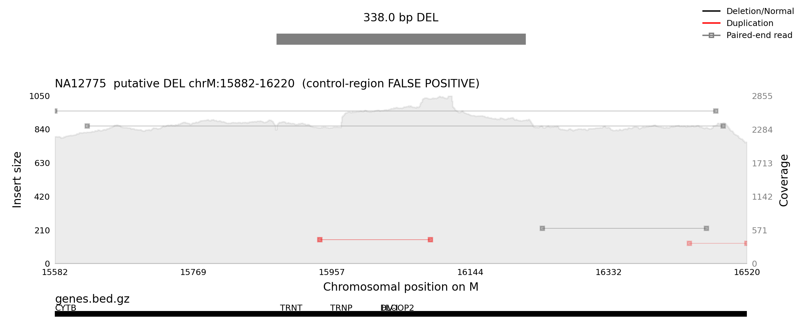

# SV false-positive example — mitochondrial control region (NA12775, chrM:15882–16220)

A worked example of the kind of **false-positive deletion** a split-read / discordant-pair SV
caller can emit in the mitochondrial **control region (D-loop)** — and why MitoHPC's SV caller does
**not** call it.



*Putative `DEL chrM:15882–16220` (338 bp) in the 1000G healthy sample **NA12775** (~2300× chrM),
300 bp buffer each side, with the MitoHPC gene track. Rendered with samplot 1.3.1 on the same
reference-aligned BAM the caller reads.*

## The region

`chrM:15882–16220` straddles the boundary between the coding genome and the **control region**:

| span | feature |
|------|---------|
| …–15887 | tail of **MT-CYB** (CYTB) |
| 15887–15953 | **tRNA-Thr** (`TRNT`) |
| 15955–16023 | **tRNA-Pro** (`TRNP`) |
| 16024–16383 | **HV-I / HVR1** — hypervariable region 1 of the **D-loop / control region** |

This is one of the densest false-positive zones in the mitochondrial genome:

- **Hypervariability.** HVR1 is the most polymorphic stretch of mtDNA; dense mismatches vs. rCRS
  produce soft-clips and chimeric/mismapped reads that cluster into spurious breakpoints.
- **D-loop / 7S DNA.** The control region carries a third strand (7S DNA), which inflates and
  distorts coverage and spawns discordant/everted read pairs — note the coverage **rises** in the
  middle of the window rather than dropping.
- **Origin proximity.** It sits just upstream of the artificial linear origin (16569↔1); fragments
  of reads that genuinely cross the origin land here.
- **Homopolymer structure** (e.g. the poly-C tract around 16184) adds alignment noise.

## Why this is a false positive (what the plot shows)

A *real* heteroplasmic deletion shows a **coverage drop** across the deleted span (proportional to
its heteroplasmy) plus a clean cluster of **split reads** at consistent breakpoints. Here, neither
is present:

- **Coverage is continuous — even elevated.** Depth across 15882–16220 holds at the ~2300×
  baseline and *bumps up* over the control region. There is no dosage evidence for a deletion
  (MitoHPC's coverage-dosage heteroplasmy `AFC ≈ 0`).
- **The only "evidence" is scattered, inconsistent pairs** — a few duplication-orientation (red)
  and large-insert (gray) read pairs with no shared, repeated breakpoint. That is exactly the
  signal a naive split-read/discordant caller over-clusters into a junction.

## How MitoHPC handles it

On NA12775, MitoHPC's SV caller emits **zero records** for this region (verified: `callSV.sh` →
empty `*.sv.tab`). Three independent layers keep it out of the call set:

1. **No consistent junction.** The scattered discordant reads never form a well-supported
   split-read cluster (`extract_junctions` requires repeated `SA`-tag breakpoints + minimum
   support), so no candidate is even created — the primary reason there are zero records here.
2. **Coverage-dosage gate.** Even if a candidate formed, with no coverage drop `AFC ≈ 0` → it
   fails the `no_cvg_drop` / `low_dosage` filter and cannot reach `PASS`.
3. **Control-region mask.** The D-loop is masked (`DLOOP.bed.gz` covers chrM 16023–16769 and
   0–576), so any breakpoint landing here is `DLOOP`-flagged (non-`PASS`) regardless of support.

So this region is a useful **negative control**: it is where over-eager callers light up, and
where MitoHPC's PASS set should stay empty. In `HP_SV_PLOT_ALL` visualization mode a call like this
— if one existed — would render with an amber non-`PASS` status and would **not** be written with
the `.filterpass` filename marker.

---

*Regenerate the image:*

```bash
samplot plot \
  -n "NA12775  putative DEL chrM:15882-16220  (control-region FALSE POSITIVE)" \
  -b test/sv/real/NA12775.chrM.bam \
  -o docs/sv_fp_NA12775_control_region.png \
  -c chrM -s 15882 -e 16220 -t DEL -w 300 \
  -A RefSeq/genes.bed.gz
```
